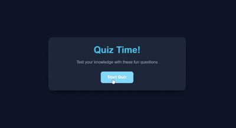

# Quiz Game

<div align="left">
  
</div>

A simple browser-based quiz application I built to practice vanilla JavaScript.

## Live Demo
🔗 [Play the Quiz Game](https://mabbasdev.github.io/01-quiz-game/)

## Features
- Start screen, quiz screen, and results screen
- 5 multiple-choice questions about general knowledge
- Score tracking throughout the quiz
- Color feedback when selecting answers (green = correct, red = incorrect)
- Progress bar that fills as you advance
- Results page showing final score and a message based on performance
- Restart button to play again

## What I Used
- HTML
- CSS
- JavaScript (no frameworks/libraries)

## Things I Learned / Practiced

**JavaScript**
- Selecting DOM elements with `getElementById`
- Adding/removing CSS classes to show/hide screens
- Creating buttons dynamically with `createElement`
- Adding event listeners to buttons
- Using `dataset` attributes to store answer correctness
- `setTimeout` to delay moving to next question (gives time to see feedback)
- Tracking game state with variables (current question index, score)
- Arrays of objects for storing quiz data
- `forEach` loops for iterating through answers

**CSS**
- Flexbox for layout
- Hover effects on buttons
- Responsive design with media queries
- Progress bar animation

## Project Structure
```
quiz-game/
  ├── index.html     # all the HTML
  ├── style.css      # all the styles
  ├── script.js      # all the JavaScript
  └── README.md      # documentation
```
## How to Run
Just open `index.html` in any browser. No build steps, no dependencies.

## Connect
- GitHub: [@mabbasdev](https://github.com/mabbasdev)
- LinkedIn: [Connect with me](https://www.linkedin.com/in/mabbasdev/)
- X: [@mabbasdev](https://x.com/mabbasdev)

## What I'd Add If I Kept Working On It
- More questions
- Different categories
- Timer per question
- High score tracking

---

That's it. Simple project, got comfortable with DOM manipulation and basic game flow.
